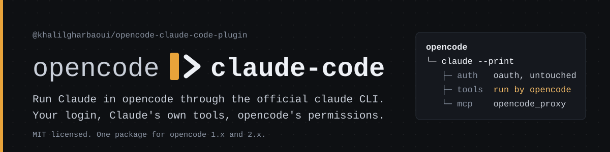

<picture>
  <source media="(prefers-color-scheme: dark)" srcset="site/public/banner-dark.svg">
  <source media="(prefers-color-scheme: light)" srcset="site/public/banner-light.svg">
  
</picture>

# @khalilgharbaoui/opencode-claude-code-plugin

[](https://www.npmjs.com/package/@khalilgharbaoui/opencode-claude-code-plugin)
[](https://www.npmjs.com/package/@khalilgharbaoui/opencode-claude-code-plugin)
[](https://www.npmjs.com/package/@khalilgharbaoui/opencode-claude-code-plugin)
[](https://github.com/khalilgharbaoui/opencode-claude-code-plugin/stargazers)
[](https://github.com/khalilgharbaoui/opencode-claude-code-plugin/forks)
[](https://github.com/khalilgharbaoui/opencode-claude-code-plugin/graphs/contributors)
[](https://opencode-claude-code-plugin.dev/internals/testing/)
[](https://github.com/khalilgharbaoui/opencode-claude-code-plugin/actions/workflows/publish.yml)
[](./LICENSE)
[](https://www.buymeacoffee.com/khalilgharbaoui)

**Claude Code is the provider.** This opencode plugin runs Anthropic's Claude models through the official **Claude Code CLI** (`claude`) as a subprocess instead of calling the HTTP API. opencode inherits whatever that CLI is logged in as (a Claude subscription, an API key, Bedrock or Vertex), gets Claude's own tools, MCP servers and skills, and keeps running the tools that touch your machine itself, behind its own permission prompts. One package serves opencode 1.x and 2.x.

- **Your CLI's login, untouched.** The plugin never reads, stores or replays a token. Lifting the OAuth session out of the official client is what proxy-style plugins do, and Anthropic disallowed that for third-party Claude use in February 2026. This plugin structurally cannot do it.
- **opencode runs the tools.** `Bash`, `Edit`, `Write`, `WebFetch` and `Task` are proxied by default: Claude calls an in-process MCP tool and opencode executes it, under its own permissions and audit log.
- **Billed as your CLI bills.** Headless `claude --print` on a subscription draws from the plan's ordinary usage limits; an API key bills pay as you go. The CLI's `apiKeySource` says which, every session, and the plugin warns when a stray `ANTHROPIC_API_KEY` would move the bill.

**Docs:** <https://opencode-claude-code-plugin.dev/> (the same pages are the markdown under [`docs/`](./docs/), which GitHub renders on its own).

## Quickstart

1. **Install and log in the Claude Code CLI.** The plugin drives an existing `claude`; it does not bundle one.

   ```bash
   claude --version      # e.g. 2.1.284 (Claude Code)
   claude auth status    # which account you are signed in as
   claude auth login     # only if you are not signed in yet
   ```

2. **Add the package to opencode's global config.** That spec is the whole install. Do not `npm install` it yourself: opencode resolves and caches plugin packages on its own.

   ```json
   {
     "plugin": ["@khalilgharbaoui/opencode-claude-code-plugin"]
   }
   ```

   `~/.config/opencode/opencode.json` on opencode 1.x. opencode 2 reads the same key; its native spelling is `plugins`.

3. **Quit opencode fully and relaunch.** Plugins load once, at process start. The model picker now has a **Claude Code (Default)** provider with entries such as `Claude Sonnet 5.5 (2×)` and `Claude Opus 5 (5×)`; the suffix is each model's list price relative to Haiku.

Nothing in the picker? [Troubleshooting](./docs/troubleshooting/symptoms.md) is keyed on the first thing you see. `/claude-code-doctor` in any session prints what the plugin thinks is happening, without calling a model.

## What you get

| | |
|---|---|
| **Selective tool proxy** | Choose, per tool, whether Claude Code or opencode executes it. Proxied calls end on an event (the result, an abort, the next message, the child exiting), never on a clock. [Guide](./docs/guides/tool-proxy.md) |
| **Claude's own tools, MCP and skills** | `Read`, `Grep`, `Glob`, `WebSearch` run in Claude Code; your opencode MCP servers are bridged in; your opencode skills can be staged for Claude's `Skill` tool. [MCP](./docs/configuration/mcp.md) · [Skills](./docs/configuration/skills.md) |
| **Several accounts** | `"accounts": ["personal", "work"]` becomes one provider per account. Out of usage mid-task? One line says which account, which window and when it resets in your own time zone, and names the others to pick a model from. [Accounts](./docs/configuration/accounts.md) |
| **Subagents: your account, their model** | `forceModel`, `reasoningEffort` and `cacheTtl` in an agent file, inheriting the caller's account. `task_batch` runs several subagents at once. [Subagents](./docs/configuration/subagents.md) |
| **18 models, reasoning variants, fast mode** | Haiku 4.5 through Opus 5.5, Fable and Mythos, each with a `(N×)` list-price suffix, `low` to `max` effort variants, and a fallback chain for a model this account cannot run today. [Models](./docs/models.md) |
| **`/btw` and `/claude-code-doctor`** | Side questions on the live process, and a health report whose `bundle` form is redacted by allowlist so it is safe to paste into a public issue. [`/btw`](./docs/guides/btw.md) · [Doctor](./docs/guides/doctor.md) |
| **Ships its own setup skill** | Ask Claude to configure it. The bundled `claude-code-plugin` skill knows every option, env var, model id and troubleshooting rule, is staged into Claude Code on every spawn, and tests keep it in step with the code. [Skills](./docs/configuration/skills.md) |
| **Read-only preset, plan mode** | `"permissionPreset": "read-only"` holds at the CLI, the proxy and the permission layer at once. [Permissions](./docs/configuration/permissions.md) |

## How this compares

| | opencode's native `anthropic` provider | This plugin | Proxy and token-reuse plugins |
|---|---|---|---|
| **Authentication** | A Platform API key in opencode's auth store. | Whatever the official `claude` CLI holds. No token is read, stored or replayed. | The Claude OAuth session, used outside the official client. |
| **Terms-of-service status** | The ordinary API route. | Sanctioned: the official client does the authenticating. | Disallowed. Anthropic disallowed reusing subscription authentication for third-party Claude use in February 2026, and each of those projects carries its own disclaimer. |
| **Who runs Bash, Edit, Write** | opencode. | opencode, by default; `Read`, `Grep`, `Glob` run in Claude Code. | opencode. |
| **What it costs you** | Baseline. | A `claude` child per conversation under a cap of 16; Claude Code may compact its own context behind opencode's back. | One more moving part, plus the account risk above. |

The [full comparison](./docs/comparison.md) has nine rows, names the projects in the third column, and quotes their own READMEs.

## Built from measurements

A dozen test files drive a fake `claude` through real turns: the stream parser, the proxy broker, both watchdogs, abort, respawn, account failover and the model fallback chain are exercised end to end. Every rule in [`AGENTS.md`](./AGENTS.md) names the probe, the version and the number that produced it, and the evidence lives in [`docs/agents-history.md`](./docs/agents-history.md). Two runtime dependencies. The [site](https://opencode-claude-code-plugin.dev/) reports the live numbers, rebuilt daily.

## Documentation

- **Start here:** [Introduction](./docs/introduction.md) · [Getting started](./docs/getting-started.md) · [opencode 2](./docs/opencode-2.md) · [Models](./docs/models.md) · [Billing](./docs/billing.md)
- **Configuration:** [Options](./docs/configuration/options.md) · [Environment variables](./docs/configuration/environment.md) · [Accounts](./docs/configuration/accounts.md) · [Subagents](./docs/configuration/subagents.md) · [Permissions](./docs/configuration/permissions.md) · [MCP](./docs/configuration/mcp.md) · [Skills](./docs/configuration/skills.md) · [Logging](./docs/configuration/logging.md)
- **Guides:** [Tool proxy](./docs/guides/tool-proxy.md) · [Background subagents](./docs/guides/background-subagents.md) · [`/btw`](./docs/guides/btw.md) · [`/claude-code-doctor`](./docs/guides/doctor.md) · [Per-turn stats](./docs/guides/turn-stats.md) · [Compaction and thinking](./docs/guides/compaction-and-thinking.md) · [Interactive transport](./docs/guides/interactive-transport.md) · [Other plugins](./docs/guides/compatibility.md)
- **Troubleshooting:** [Start from the symptom](./docs/troubleshooting/symptoms.md) · [Longer cases](./docs/troubleshooting/longer-cases.md) · [Which login bills what](./docs/troubleshooting/which-login-bills-what.md) · [Known limitations](./docs/troubleshooting/known-limitations.md)
- **Internals:** [How a turn works](./docs/internals/how-a-turn-works.md) · [How a proxied call ends](./docs/internals/how-a-proxied-call-ends.md) · [Scratch files and security](./docs/internals/scratch-files-and-security.md) · [Measurement culture](./docs/internals/measurement-culture.md) · [Testing](./docs/internals/testing.md) · [Development](./docs/internals/development.md) · [Releasing](./docs/internals/release.md)

### Where the old README sections went

This README used to hold all of the above. Release notes and bookmarks point at its anchors, so:

| Old README anchor | Now at |
|---|---|
| `#configuration`, `#options-reference` | [docs/configuration/options.md](./docs/configuration/options.md) |
| `#environment-variables` | [docs/configuration/environment.md](./docs/configuration/environment.md) |
| `#models`, `#fast-mode` | [docs/models.md](./docs/models.md) |
| `#multiple-claude-code-accounts`, `#account-failover` | [docs/configuration/accounts.md](./docs/configuration/accounts.md) |
| `#billing` | [docs/billing.md](./docs/billing.md) |
| `#troubleshooting` | [docs/troubleshooting/symptoms.md](./docs/troubleshooting/symptoms.md) |
| `#plugin-health-with-claude-code-doctor` | [docs/guides/doctor.md](./docs/guides/doctor.md) |
| `#selective-tool-proxy` | [docs/guides/tool-proxy.md](./docs/guides/tool-proxy.md) |
| `#credits` | [docs/credits.md](./docs/credits.md) |

## Credits

Made and maintained by [Khalil Gharbaoui (@khalilgharbaoui)](https://github.com/khalilgharbaoui). This plugin absorbs work from its forks directly, cherry-picked with the original authorship preserved or reimplemented with the author named in the commit. The people behind the features you are using, and what each built, are on the [Credits](./docs/credits.md) page; `git log --author` on this repo shows the preserved authorship.

Free and MIT-licensed. If the plugin saves you time, you can buy [its maintainer](https://github.com/khalilgharbaoui) a coffee:

<a href="https://www.buymeacoffee.com/khalilgharbaoui"></a>

## License

MIT. See [LICENSE](./LICENSE). The first version was written by Émilien ([@unixfox](https://github.com/unixfox)); everything since by [Khalil Gharbaoui](https://github.com/khalilgharbaoui) and the people in [Credits](./docs/credits.md).
